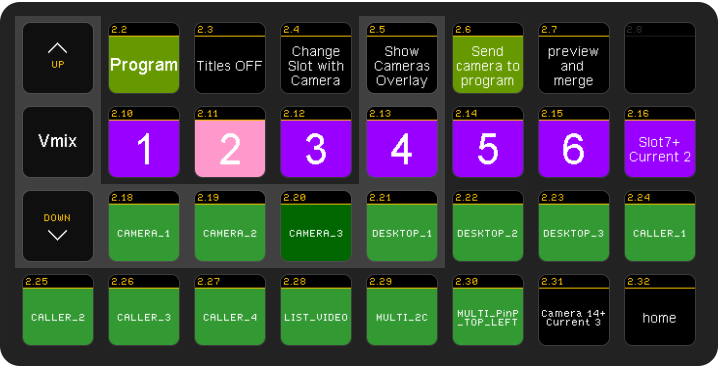
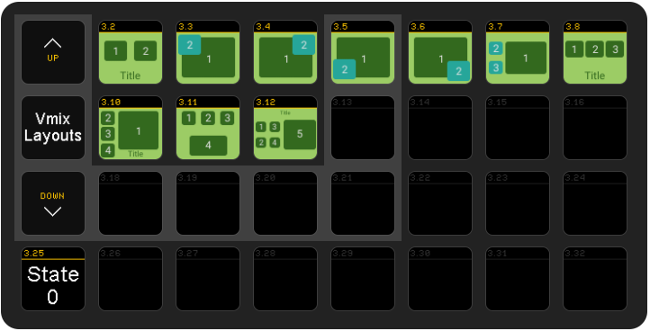
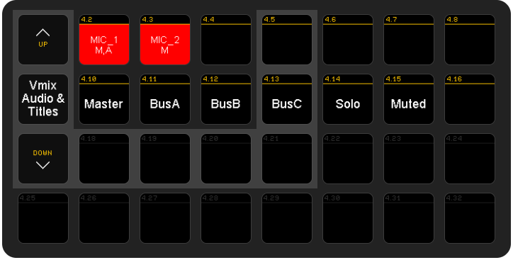

# Using Companion with Vmix and Powershell Scripts

Being able to move scripts is important so all companion powershell command are using an environment variable (VMIX_SCRIPTS) which holds the location of the powershell custom scripts.

All settings are kept in the config.xml file and this file is used to keep button state.

## Page 2

This is how this page looks

### Button 2.2 : Preview - Program

This is a latch button

Running 2 scripts in Press state

- ` pwsh %VMIX_SCRIPTS%\setAttributeInConfig.ps1 working active`
- ` pwsh %VMIX_SCRIPTS%\oscControlVmix.ps1` (after 50 ms)

The first script just sets the working attribute to active (aka program) and the second script
is a script that updates the color and text of many buttons based on the values (state) of the config script

Running 2 scripts in Release state

- ` pwsh %VMIX_SCRIPTS%\setAttributeInConfig.ps1 working preview`
- ` pwsh %VMIX_SCRIPTS%\oscControlVmix.ps1` (after 50 ms)

### Button 2.3 : Titles OFF/ON

This is a latch button

Every camera (not multilayer but single source camera or caller or desktop capture) has a title embedded in a layer.
This script enables disabled these titles (but does that only for the sources that are included in the multilayered program or preview)

This runs a Vmix script (pending to port to a powershell script)

### Button 2.4 : Change Slot with Camera

Running 2 scripts to

`pwsh %VMIX_SCRIPTS%\sendCameraToSlot.ps1`
`pwsh %VMIX_SCRIPTS%\greenRoom.ps1` (after 500ms delay)

The first script checks which slot is selected (buttons 2.10 - 2.16) and which camera is selected (buttons 2.18 - 2.31) and depending if
we have button 2.2 to program or preview, sets the slot (in the multilayer) to the selected camera

### Button 2.5 : Show Cameras Overlay

This button runs a go script that creates an image that is used then to overlay over the preview or program to identify which slot is which.

Once you release the button the overlay is hidden

Press State scripts:

`pwsh.exe %VMIX_SCRIPTS%\createOverlaySlotImage.ps1`
`ViewSlotLayout` (internal vmix script in custom_scripts folder, to be ported to powershell)

Release state:

`HideSlotLayout`

### Button 2.6 : Send camera to program/preview

This follows the value of button 2.2 (color + text)

Scripts running

- `pwsh %VMIX_SCRIPTS%\sendCameraToPreviewOrProgram.ps1`
- `pwsh %VMIX_SCRIPTS%\greenRoom.ps1` (after 500ms)

Depending on the camera selected (buttons 2.18-2.31) and the state of 2.2 it sends it to program or preview.

It then updates the greenRoom multilayer I have created (basically it writes if the user/camera/caller, is on air/ preview / greenRoom)

### Button 2.7 : preview and merge

Something like button 2.6 but if we want to see the merge effect, it first sends to preview and then merges

### Button 2.10-2.16 : Selecting slots

Running the following scripts

For example for 2.10 (slot 1)

- `pwsh %VMIX_SCRIPTS%\setAttributeInConfig.ps1 selected_slot 1`
- `pwsh %VMIX_SCRIPTS%\oscControlVmix.ps1`

The first script just sets the selected_slot attribute to 1 and then updates the colors and text (if needed)

The same for all buttons 2.10-2.15

Button 2.16 just runs the previews scripts with delay (so the longer you press it increases the selected slot)

For example

- `pwsh %VMIX_SCRIPTS%\setAttributeInConfig.ps1 selected_slot 7`
- `pwsh %VMIX_SCRIPTS%\oscControlVmix.ps1`
- `pwsh %VMIX_SCRIPTS%\setAttributeInConfig.ps1 selected_slot 8` (relative delay 1000)
- `pwsh %VMIX_SCRIPTS%\oscControlVmix.ps1`
- `pwsh %VMIX_SCRIPTS%\setAttributeInConfig.ps1 selected_slot 9` (relative delay 1000)
- `pwsh %VMIX_SCRIPTS%\oscControlVmix.ps1`

and so on

### Button 2.18-2.31 : Selecting camera

As above the script is very simple

- `pwsh %VMIX_SCRIPTS%\setAttributeInConfig.ps1 selected_camera 1`
- `pwsh %VMIX_SCRIPTS%\oscControlVmix.ps1`

The second script is the one the finds the names of the cameras and sets them with the correct color (and selected color if selected)

Button 2.31 is as button 2.16. Pressing longer will increase the camera number

## Page 3

This is how this page looks

This buttons are custom images and represent the various multilayer setups in vmix

For example

### Button 3.2 - 2 windows setup

Script running

- `pwsh %VMIX_SCRIPTS%\setAttributeInConfig.ps1 selected_title_min 1`
- `pwsh %VMIX_SCRIPTS%\setAttributeInConfig.ps1 selected_title_max 2` (relative delay 100)
- `pwsh %VMIX_SCRIPTS%\setAttributeForLayoutInConfig.ps1 MULTI_2C` (relative delay 100)
- `pwsh %VMIX_SCRIPTS%\sendLayoutToPreviewOrProgram.ps1` (relative delay 1000)
- `pwsh %VMIX_SCRIPTS%\greenRoom.ps1` (relative delay 1500)

Why do we need those min an max values?

The first time we press the button it will show the layout. If you press again it will cycle between what is in slot 1 and 2.
The min max values tell, which layers we have put the cameras. In this case it is 1 and 2.

** VALUES ARE ZERO BASED **.

This means 1 is the second layer in the layout.

Now the 3rd script sets the selected layout name. If it is the same as the currently selected layout, it just increases state (so it will send the camera instead of the layout). And it will cycle.

### Button 3.25

This buttons shows the current state of the selected button. It is set by other script. It will not react to press.

## Page 4

This is how this page looks

### Button 4.2 - 4.8

These buttons are for AUDIO only input and need to start with AUDIO\_ in Vmix

When we press a button 2 scripts run

- `pwsh %VMIX_SCRIPTS%\setAttributeInAudioConfig.ps1 selected 0`
- `pwsh %VMIX_SCRIPTS%\oscControlVmixAudio.ps1`

The first you set which button is selected (0 , 1, 2, ....)
The second updates the color of the buttons (this and the next row)

For example it is Red if muted, Green if Solo etc.

The second script also tells as to which busses they belong too.

### Buttons 4.10 - 4.15

When you press a button (one from 4.2 to 4.8) the buttons (Master, BusA, BusB, BusC, Solo, Muted) are highlighted according to the values
of the selected button.

You can then press those buttons to change that selected buttons state.

For example for master button runs the following scripts

- `pwsh %VMIX_SCRIPTS%\toggleAudioParameter.ps1 M`
- `pwsh %VMIX_SCRIPTS%\oscControlVmixAudio.ps1` (relative delay 100 ms)

The first script just uses M,A,B,C,SOLO,MUTE, to toggle the audio parameters.
